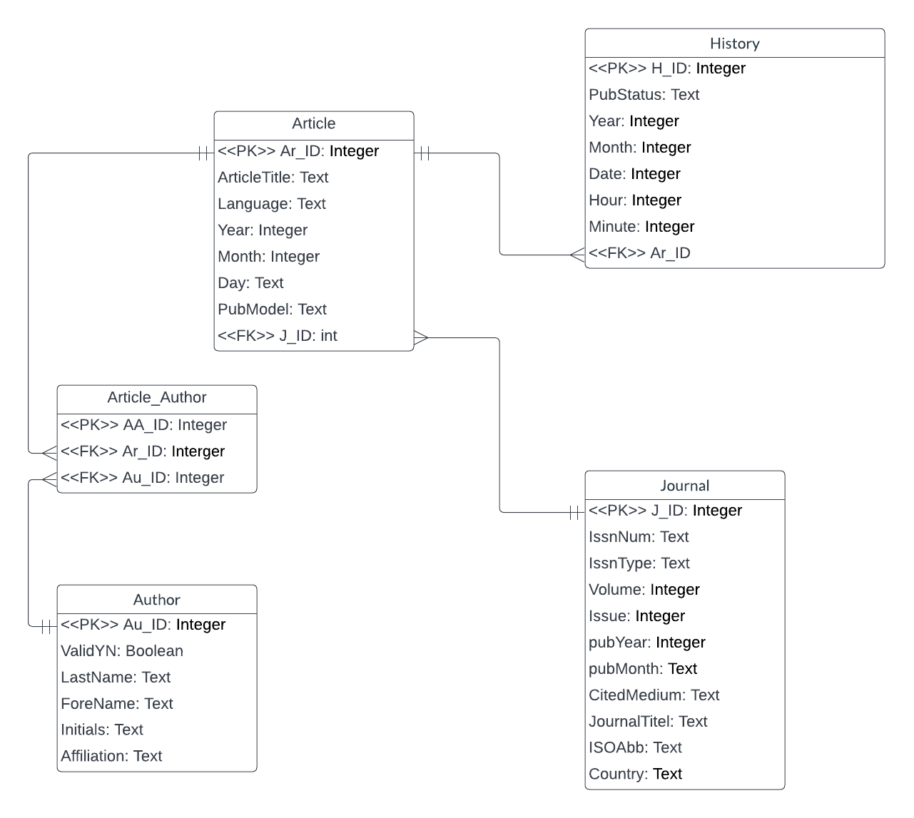
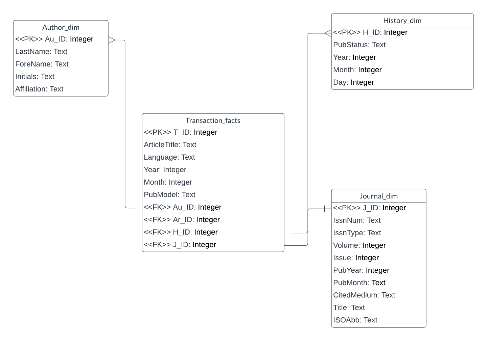
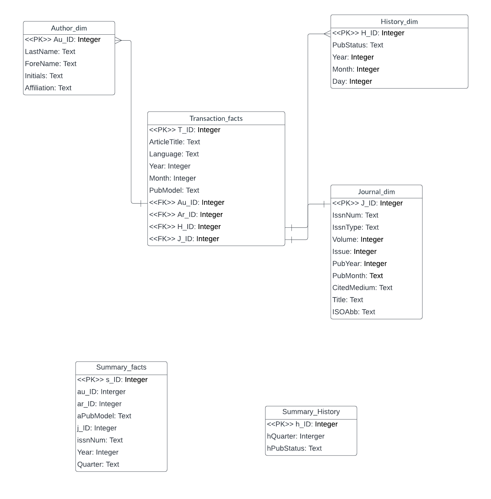

#Group Member:

##Xinchang Tong (tong.xin@northeastern.edu)
##Shuyue Gao (gao.shuy@northeastern.edu)
##Chanyuan Hou (hou.cha@northeastern.edu)

##Contributions:
Part1: Xinchang Tong
Part2-1: ShuyueGao
Part2-2: Chanyuan Hou
Part3: ShuyueGao, Chanyuan Hou

```{r}
library(RSQLite)

fpath = "/Users/MaisieGao/Downloads/databases/"
dbfile = "practicum2.db"

dbcon <- dbConnect(RSQLite::SQLite(), paste0(fpath,dbfile))
```

```{sql connection=dbcon}
PRAGMA foreign_keys = ON
```
##Part1-1##
----------------------------------------------------------------------------------
# The ERD for part1 of the practicum


##Part1-2##
#Realize the relational schema in SQLite 
-----------------------------------------------------------------------------------

```{sql connection=dbcon}
DROP TABLE IF EXISTS History
```

```{sql connection=dbcon}
DROP TABLE IF EXISTS Article_Author
```

```{sql connection=dbcon}
DROP TABLE IF EXISTS Article
```

```{sql connection=dbcon}
DROP TABLE IF EXISTS Author
```

```{sql connection=dbcon}
DROP TABLE IF EXISTS Journal
```

```{sql connection=dbcon}
CREATE TABLE IF NOT EXISTS Journal(
  j_ID INTEGER PRIMARY KEY AUTOINCREMENT,
  issnNum TEXT NOT NULL,
  issnType TEXT NOT NULL,
  volume INTEGER NOT NULL,
  issue INTEGER NOT NULL,
  pubYear INTEGER NOT NULL,
  pubMonth TEXT NOT NULL,
  citedMedium TEXT NOT NULL,
  jTitle TEXT NOT NULL,
  isoAbb TEXT NOT NULL,
  country TEXT NOT NULL
)
```

```{sql connection=dbcon}
CREATE TABLE IF NOT EXISTS Article(
  ar_ID INTEGER PRIMARY KEY AUTOINCREMENT,
  aTitle TEXT NOT NULL,
  language TEXT NOT NULL,
  year INTEGER NOT NULL,
  month INTEGER NOT NULL,
  day TEXT NOT NULL,
  pubModel TEXT NOT NULL,
  j_ID INTEGER NOT NULL,
  FOREIGN KEY (j_ID) REFERENCES Journal(j_ID)
)
```

```{sql connection=dbcon}
CREATE TABLE IF NOT EXISTS Author(
  au_ID INTEGER PRIMARY KEY AUTOINCREMENT,
  valid BOOLEAN NOT NULL,
  lastN TEXT NOT NULL,
  foreN TEXT NOT NULL,
  initials TEXT NOT NULL,
  affiliation TEXT NOT NULL
)
```

```{sql connection=dbcon}
CREATE TABLE IF NOT EXISTS Article_Author(
  aa_ID INTEGER PRIMARY KEY AUTOINCREMENT,
  ar_ID INTEGER NOT NULL,
  au_ID INTEGER NOT NULL,
  FOREIGN KEY (ar_ID) REFERENCES Article(ar_ID),
  FOREIGN KEY (au_ID) REFERENCES Author(au_ID)
)
```

```{sql connection=dbcon}
CREATE TABLE IF NOT EXISTS History(
  h_ID INTEGER PRIMARY KEY AUTOINCREMENT,
  pubStatus TEXT NOT NULL,
  hYear INTEGER NOT NULL,
  hMonth INTEGER NOT NULL,
  hDay INTEGER NOT NULL,
  hHour INTEGER NOT NULL,
  hMinute INTEGER NOT NULL,
  ar_ID INTEGER NOT NULL,
  FOREIGN KEY (ar_ID) REFERENCES Article(ar_ID)
)
```

##Part1-3##
#Extract and transform the data from the XML and then load into the appropriate tables in the database. 
-----------------------------------------------------------------------------------

```{r filenames}
library(XML)
path <- "/Users/MaisieGao/Downloads/databases/"
xmlN <- "pubmed_sample.xml"
xmlPath <- paste0(path, xmlN)

# Reading the XML file and parse into DOM
xmlDOM <- xmlParse(file = xmlPath)

# get the root node / size of the DOM tree
root <- xmlRoot(xmlDOM)
arNum <- xmlSize(root)
```


```{r}
for (i in 1:arNum){
  #the article node for this round
  pubArN = root[[i]]
  
  #article node, medlineJournalInfo node, history node
  arN <- pubArN[["MedlineCitation"]][["Article"]]
  mJourInfoN <- pubArN[["MedlineCitation"]][["MedlineJournalInfo"]]
  hisN <- pubArN[["PubmedData"]][["History"]]
  
  #========1) Parsing Journal===========
  jN <- arN[["Journal"]]
  
  issnNum <- xmlValue(jN[["ISSN"]])
  issnType <- xmlGetAttr(jN[["ISSN"]], "IssnType")
  volume <- xmlValue(jN[["JournalIssue"]][["Volume"]])
  issue <- xmlValue(jN[["JournalIssue"]][["Issue"]])
  
  #parsing date part:
  #two cases: Year + Month & MedlineDate
  pubYear <- xmlValue(jN[["JournalIssue"]][["PubDate"]][["Year"]])
  pubMonth <- xmlValue(jN[["JournalIssue"]][["PubDate"]][["Month"]])
  if(is.na(pubYear) ){
    date <- xmlValue(jN[["JournalIssue"]][["PubDate"]][["MedlineDate"]])
    splitD <- strsplit(date, split=" ")
    pubYear <- splitD[[1]][1]
    pubMonth <- splitD[[1]][2]
  }
  
  citedMedium <- xmlGetAttr(jN[["JournalIssue"]], "CitedMedium")
  jTitle <- xmlValue(jN[["Title"]])
  isoAbb <- xmlValue(jN[["ISOAbbreviation"]])
  country <- xmlValue(mJourInfoN[["Country"]])
  
  #check if the journal exists
  sql_jExi <- paste0("SELECT j_ID FROM Journal WHERE jTitle=\"", jTitle, "\" AND pubYear=\"", pubYear,"\" AND pubMonth=\"", pubMonth,"\";")
  j_ID <- dbGetQuery(dbcon, sql_jExi)[1,1]
  #if not, insert
  if(is.na(j_ID)){
    sqlInsJ <- paste0("INSERT INTO Journal(issnNum, issnType, volume, issue, pubYear, pubMonth, citedMedium, jTitle, isoAbb, country) 
                   VALUES (\"", issnNum, "\", 
                          \"", issnType, "\",
                          \"", volume, "\", 
                          \"", issue, "\",
                          \"", pubYear, "\",
                          \"", pubMonth, "\",
                          \"", citedMedium, "\",
                          \"", jTitle, "\",
                          \"", isoAbb, "\",
                          \"", country, "\");")
    dbExecute(dbcon, sqlInsJ)
  }
  
  
  
  #========2) Parsing Article===========
  aTitle <- xmlValue(arN[["ArticleTitle"]])
  language <- xmlValue(arN[["Language"]])
  
  articleDate <- arN[["ArticleDate"]]
  year <- xmlValue(articleDate[["Year"]])
  if(is.na(year)){
      year <- -1
    }
  month <- xmlValue(articleDate[["Month"]])
  if(is.na(month)){
      month <- -1
    }
  day <- xmlValue(articleDate[["Day"]])
  if(is.na(day)){
      day <- -1
    }
  
  pubModel <- xmlGetAttr(arN, "PubModel")
  
  #get FK - j_ID
  sql_jIDtoA <- paste0("SELECT j_ID FROM Journal WHERE jTitle=\"", jTitle, "\" AND pubYear=\"", pubYear,"\" AND pubMonth=\"", pubMonth,"\";")
  j_ID <- dbGetQuery(dbcon, sql_jIDtoA)[1,1] 
  
  #check if the article exists
  sql_aExi <- paste0("SELECT ar_ID FROM Article WHERE aTitle=\"", aTitle, "\" AND year=\"", year,"\" AND month=\"", month,"\" AND day=\"", day,"\";")
  ar_ID <- dbGetQuery(dbcon, sql_aExi)[1,1]
  #if not, insert
  if(is.na(ar_ID)){
    sqlInsAr <- paste0("INSERT INTO Article(aTitle, language, year, month, day, pubModel, j_ID) 
                   VALUES (\"", aTitle, "\", 
                          \"", language, "\",
                          \"", year, "\", 
                          \"", month, "\",
                          \"", day, "\",
                          \"", pubModel, "\",
                          \"", j_ID, "\");")
    dbExecute(dbcon, sqlInsAr)
  }
 
  
  
  #========3) Parsing History===========
  hNum <- xmlSize(hisN)
  for (h in 1:hNum){
    curHisN <- hisN[[h]]
    
    pubStatus <- xmlGetAttr(curHisN, "PubStatus") 
    hYear <- xmlValue(curHisN[["Year"]])
    hMonth <- xmlValue(curHisN[["Month"]])
    hDay <- xmlValue(curHisN[["Day"]])
    hHour <- xmlValue(curHisN[["Hour"]])
    if(is.na(hHour)){
      hHour <- -1
    }
    hMinute <- xmlValue(curHisN[["Minute"]])
    if(is.na(hMinute)){
      hMinute <- -1
    }
    
    #get FK - ar_ID
    sql_arIDtoH <- paste0("SELECT j_ID FROM Article WHERE aTitle=\"", aTitle, "\" AND year=\"", year,"\" AND month=\"", month,"\" AND day=\"", day,"\";")
    ar_ID <- dbGetQuery(dbcon, sql_arIDtoH)[1,1]
    
    sqlInsH <- paste0("INSERT INTO History(pubStatus, hYear, hMonth, hDay, hHour, hMinute, ar_ID) 
                   VALUES (\"", pubStatus, "\", 
                          \"", hYear, "\",
                          \"", hMonth, "\", 
                          \"", hDay, "\",
                          \"", hHour, "\",
                          \"", hMinute, "\",
                          \"", ar_ID, "\");")
    dbExecute(dbcon, sqlInsH)
  }
  
  

  #========4) Parsing Author & Link Article/Author===========
  #Get ar_ID for this round
  sql_aExi <- paste0("SELECT ar_ID FROM Article WHERE aTitle=\"", aTitle, "\" AND year=\"", year,"\" AND month=\"", month,"\" AND day=\"", day,"\";")
  ar_ID <- dbGetQuery(dbcon, sql_aExi)[1,1]
  
  #===Parsing Author=====
  auListN <- arN[["AuthorList"]]
  auNum <- xmlSize(auListN)
  for (au in 1:auNum){
    curAuN <- auListN[[au]]
    
    validStr <- xmlGetAttr(curAuN, "ValidYN")
    if (validStr == "Y") {
      valid <- 1
    }else{
      valid <- 0
    }
    lastN <- xmlValue(curAuN[["LastName"]])
    foreN <- xmlValue(curAuN[["ForeName"]])
    initials <- xmlValue(curAuN[["Initials"]])
    affiliation <- xmlValue(curAuN[["Affiliation"]])
    
    #check if the author exists
    sql_auExi <- paste0("SELECT au_ID FROM Author WHERE lastN=\"", lastN, "\" AND valid=\"", valid, "\" AND foreN=\"", 
                        foreN,"\" AND initials=\"", initials,"\" AND affiliation=\"", affiliation,"\";")
    au_ID <- dbGetQuery(dbcon, sql_auExi)[1,1]
    #if not, insert
    if(is.na(au_ID)){
      sqlInsAu <- paste0("INSERT INTO Author(valid, lastN, foreN, initials, affiliation) 
                     VALUES (\"", valid, "\", 
                            \"", lastN, "\",
                            \"", foreN, "\", 
                            \"", initials, "\",
                            \"", affiliation, "\");")
      dbExecute(dbcon, sqlInsAu)
    }
    
    #===Link Article/Author=====
    #Get au_ID for this round
    sql_auExi <- paste0("SELECT au_ID FROM Author WHERE lastN=\"", lastN, "\" AND valid=\"", valid, "\" AND foreN=\"", 
                        foreN,"\" AND initials=\"", initials,"\" AND affiliation=\"", affiliation,"\";")
    au_ID <- dbGetQuery(dbcon, sql_auExi)[1,1]
    
    #insert AA
    sqlInsAA <- paste0("INSERT INTO Article_Author(ar_ID, au_ID) 
                     VALUES (\"", ar_ID, "\", 
                            \"", au_ID, "\");")
    dbExecute(dbcon, sqlInsAA)
  }
  
}
```

```{sql connection=dbcon}
SELECT * FROM Journal;
```

```{sql connection=dbcon}
SELECT * FROM Article;
```

```{sql connection=dbcon}
SELECT * FROM History;
```

```{sql connection=dbcon}
SELECT * FROM Author;
```

```{sql connection=dbcon}
SELECT * FROM Article_Author;
```

##Part2-1##
-----------------------------------------------------------------------------------

#The ERD for part2-1 of the practicum

#Realize the star schema in SQLite 

#Drop all the tables if they existed
```{sql connection=dbcon}
DROP TABLE IF EXISTS Summary_facts
```

```{sql connection=dbcon}
DROP TABLE IF EXISTS Transaction_facts
```

```{sql connection=dbcon}
DROP TABLE IF EXISTS Author_dim
```

```{sql connection=dbcon}
DROP TABLE IF EXISTS History_dim
```


```{sql connection=dbcon}
DROP TABLE IF EXISTS Journal_dim;
```

#Create Author_dim table
```{sql connection=dbcon}
CREATE TABLE Author_dim(
  au_ID INTEGER PRIMARY KEY,
  lastN TEXT NOT NULL,
  foreN TEXT NOT NULL,
  initials TEXT NOT NULL,
  affiliation TEXT NOT NULL
)
```

#Create History_dim table
```{sql connection=dbcon}
CREATE TABLE History_dim(
  h_ID INTEGER PRIMARY KEY,
  pubStatus TEXT NOT NULL,
  hYear INTEGER NOT NULL,
  hMonth INTEGER NOT NULL,
  hDay INTEGER NOT NULL
)
```


#Create Journal_dim table
```{sql connection=dbcon}
CREATE TABLE Journal_dim(
  j_ID INTEGER PRIMARY KEY,
  issnNum TEXT NOT NULL,
  issnType TEXT NOT NULL,
  volume INTEGER NOT NULL,
  issue INTEGER NOT NULL,
  pubYear INTEGER NOT NULL,
  pubMonth TEXT NOT NULL,
  citedMedium TEXT NOT NULL,
  jTitle TEXT NOT NULL,
  isoAbb TEXT NOT NULL
)
```

#Create Transaction_facts table
```{sql connection=dbcon}
CREATE TABLE Transaction_facts(
  t_ID INTEGER PRIMARY KEY AUTOINCREMENT,
  aTitle TEXT NOT NULL,
  language TEXT NOT NULL,
  year INTEGER NOT NULL,
  month INTEGER NOT NULL,
  pubModel TEXT NOT NULL,
  au_ID INTEGER NOT NULL,
  ar_ID INTEGER NOT NULL,
  h_ID INTEGER NOT NULL,
  j_ID INTEGER NOT NULL,
  FOREIGN KEY (au_ID) REFERENCES Author_dim(au_ID),
  FOREIGN KEY (ar_ID) REFERENCES Article_dim(ar_ID),
  FOREIGN KEY (h_ID) REFERENCES History_dim(h_ID),
  FOREIGN KEY (j_ID) REFERENCES Journal_dim(j_ID)
)
```

#Insert data into Author_dim
```{r}
statement1 <- 'INSERT INTO Author_dim(au_ID, lastN, foreN, initials, affiliation)
SELECT au_ID, lastN, foreN, initials, affiliation
FROM Author;'
dbExecute(dbcon, statement1)
```
```{sql connection=dbcon}
SELECT * FROM Author_dim;
```

#Insert data into History_dim
```{r}
statement2 <- 'INSERT INTO History_dim(h_ID, pubStatus, hYear, hMonth, hDay)
SELECT h_ID, pubStatus, hYear, hMonth, hDay
FROM History;'
dbExecute(dbcon, statement2)
```
```{sql connection=dbcon}
SELECT * FROM History_dim;
```


#Insert data into Journal_dim
```{r}
statement4 <- 'INSERT INTO Journal_dim(j_ID, issnNum, issnType, volume, issue, pubYear, pubMonth, citedMedium, jTitle, isoAbb)
SELECT j_ID, issnNum, issnType, volume, issue, pubYear, pubMonth, citedMedium, jTitle, isoAbb
FROM Journal;'
dbExecute(dbcon, statement4)
```
```{sql connection=dbcon}
SELECT * FROM Journal_dim;
```

#Insert data into Transaction_facts
```{r}
statement5 <- 'INSERT INTO Transaction_facts(aTitle, language, year,month,pubModel,ar_ID,j_ID,h_ID,au_ID)
SELECT Article.aTitle, Article.language, Article.year,Article.month,Article.pubModel,Article.ar_ID,Journal.j_ID,History.h_ID,Article_Author.au_ID
FROM Article
LEFT JOIN Journal
USING(j_ID)
LEFT JOIN History
USING(ar_ID)
RIGHT JOIN Article_Author
USING(ar_ID)
;'
dbExecute(dbcon, statement5)
```
```{sql connection=dbcon}
SELECT * FROM Transaction_facts;
```


##Part2-2##
--------------------------------------------------------------------------------------------------------
#The ERD for part2-2 of the practicum

#Realize the revised star schema in SQLite 

#Drop table if exists
```{sql connection=dbcon}
DROP TABLE IF EXISTS Summary_facts
```

#Create Summary_facts table that represents number of articles per time period by author and by journal
```{sql connection=dbcon}
CREATE TABLE Summary_facts(
  s_ID INTEGER PRIMARY KEY AUTOINCREMENT,
  au_ID INTEGER NOT NULL,
  ar_ID INTEGER NOT NULL,
  aPubModel TEXT NOT NULL,
  j_ID INTEGER NOT NULL,
  issnNum TEXT NOT NULL,
  Year INTEGER NOT NULL,
  Quarter TEXT NOT NULL
)
```

#Drop table if exists
```{sql connection=dbcon}
DROP TABLE IF EXISTS Summary_history
```

#Create Summary_history table that represents number of articles per time period 
```{sql connection=dbcon}
CREATE TABLE Summary_history(
  h_ID INTEGER PRIMARY KEY,
  hQuarter INTEGER NOT NULL,
  hPubStatus INTEGER NOT NULL
)
```

#Modify dimention journal table for adding one column and set default to Q1 if no specific month available
```{sql connection=dbcon}
ALTER TABLE Journal_dim
ADD jQuarter TEXT DEFAULT "Q1"
```

#Update value to new column 

#Assign the quarter to the early month if it lasting more than one month
```{sql connection=dbcon}
UPDATE Journal_dim
  SET jQuarter =
  CASE
    WHEN pubMonth LIKE "Jan%" THEN "Q1"
    WHEN pubMonth LIKE "Feb%" THEN "Q1"
    WHEN pubMonth LIKE "Mar%" THEN "Q1"
    WHEN pubMonth LIKE "Apr%" THEN "Q2"
    WHEN pubMonth LIKE "May%" THEN "Q2"
    WHEN pubMonth LIKE "Jun%" THEN "Q2"
    WHEN pubMonth LIKE "Jul%" THEN "Q3"
    WHEN pubMonth LIKE "Aug%" THEN "Q3"
    WHEN pubMonth LIKE "Sep%" THEN "Q3"
    WHEN pubMonth LIKE "Oct%" THEN "Q4"
    WHEN pubMonth LIKE "Nov%" THEN "Q4"
    WHEN pubMonth LIKE "Dec%" THEN "Q4"
    ELSE "Q1"
  END
```

```{sql connection=dbcon}
SELECT * FROM Journal_dim
```
#Modify dimention journal table for adding one column and set default to Q1 if no specific month available
```{sql connection=dbcon}
ALTER TABLE History_dim
ADD hQuarter TEXT DEFAULT "Q1"
```

#Update value to new column 

#Assign the quarter to the early month if it lasting more than one month
```{sql connection=dbcon}
UPDATE History_dim
  SET hQuarter =
  CASE
    WHEN hMonth <=3 THEN "Q1"
    WHEN hMonth >=4 and hMonth <= 6 THEN "Q2"
    WHEN hMonth >=7 and hMonth <=9 THEN "Q3"
    WHEN hMonth >=10 and hMonth <=12 THEN "Q4"
    ELSE "Q1"
  END
```

```{sql connection=dbcon}
SELECT * FROM History_dim
```

#Insert data to Summary facts table
```{r}
statement6 <- 'INSERT INTO Summary_facts(ar_ID,aPubModel,j_ID,au_ID,issnNum,Year,Quarter)
SELECT Article.ar_ID,Article.PubModel,Journal.j_ID,Article_Author.au_ID,Journal_dim.issnNum,Journal_dim.pubYear,Journal_dim.jQuarter 
FROM Article
LEFT JOIN Journal
USING(j_ID)
LEFT JOIN History
USING(ar_ID)
RIGHT JOIN Article_Author
USING(ar_ID)
JOIN Journal_dim 
USING(j_ID)
JOIN History_dim
;'
dbExecute(dbcon, statement6)
```

```{sql connection=dbcon}
SELECT * FROM Summary_facts
```
#Insert data to Summary_history table
```{r}
statement6 <- 'INSERT INTO Summary_history(h_ID,hQuarter,hPubStatus)
SELECT h_ID, hQuarter, pubStatus
FROM History_dim;'
dbExecute(dbcon, statement6)
```
```{sql connection=dbcon}
SELECT * FROM Summary_history
```


#calculate the number of authors who publicate articles ans sort them by period time

(from the article table, there are no data after 2013 Q1)
```{sql connection=dbcon}
SELECT Year, Quarter, count(distinct au_ID) as numberOfauthor
  FROM Summary_facts
 GROUP BY Year, Quarter
```

#calculate the number of articles per quarter by journal
```{sql connection=dbcon}
SELECT Year, Quarter, count(distinct j_id) AS numberOfArticle 
  FROM Summary_facts
 GROUP BY Year, Quarter 
```

#calculate the number of articles published each quarter using Summary_history in which hPubStatus = 'pubmed'
```{sql connection=dbcon}
SELECT hQuarter, count(distinct h_ID) AS numberOfArticle
FROM Summary_history
Where hPubStatus = 'pubmed'
GROUP BY hQuarter
```

##Part3##
-----------------------------------------------------------------------------------

#chart1: From this chart, we can see that 7 articles are in only print model.And 12 articles are in print-electronic model. So we could tell that electronic-print version is the new trend of published articles.
```{r}
library(ggplot2)
result <- dbSendQuery(dbcon,"SELECT aPubModel, count(DISTINCT ar_ID) AS count
                     FROM Summary_facts
                     GROUP BY aPubModel;")
chart1 = fetch(result, n=-1)
dfchart1 <- data.frame(col1=c(chart1[,1]),col2=c(chart1[,2]))
dfchart1
ggplot(data = dfchart1,
      mapping=aes(x=col1, y=col2))+ 
      geom_bar(stat = "identity", fill=rgb(0.2,0.3,0.8,0.8))+
      xlab("pubModel") +
      ylab("Number of articles")
```

#chart2: From this chart, we can see that purblications show a seasonal pattern by author

#we can see that quarter1 has then most authors publish articles
```{r}
sql2 <- dbSendQuery(dbcon,"SELECT Year, Quarter, count(distinct au_ID) as numberOfAuthor
                      FROM Summary_facts
                      GROUP BY Year, Quarter;")
chart2 = fetch(sql2, n=-1)
dfchart2 <- data.frame(col1=c(chart2[,1]),col2=c(chart2[,2]),col3=c(chart2[,3]))
dfchart2
dfchart2$period <- paste(dfchart2$col1, dfchart2$col2)
ggplot(data = dfchart2, mapping = aes(x=period, y=col3,group=1)) +
       geom_line() +
       geom_point(size=4) +
       xlab("Period") +
       ylab("Number of authour")
```

#chart3: From this chart, we can see that publication show a seasonal pattern by journal

#we can see that quarter1 has then most published journals
```{r}
sql3 <- dbSendQuery(dbcon,"SELECT Year, Quarter, count(distinct j_ID) as count_by_journal 
                      FROM Summary_facts
                      GROUP BY Year, Quarter;")
chart3 = fetch(sql3, n=-1)
dfchart3 <- data.frame(col1=c(chart3[,1]),col2=c(chart3[,2]),col3=c(chart3[,3]))
dfchart3
dfchart3$period <- paste(dfchart3$col1, dfchart3$col2)
ggplot(data = dfchart3, mapping = aes(x=period, y=col3,group=1)) +
       geom_line() +
       geom_point(size = 4) +
       xlab("Period") +
       ylab("Number of articles")
```

#chart4: From this chart, we can see that published articles show a seasonal pattern when we retrieved data from History_dim and showed the number of article published every quarter.

#The reason why we get this query is because in Journal_dim, we can only see data until 2013 Q1, to check the seasnal pattern in a different way, we decide to get data from History_dim in which pubStatus is 'pubmed'.

#We can see that the fourth quarter has the largest number of published articles from history.

#I think the difference is because 'pubmed' date in History_dim is a little bit before real published date, so plenty of articles were pubmeded in Q4 but got really published in Journal in Q1 next year.
```{r}
sql4 <- dbSendQuery(dbcon,"SELECT hQuarter, count(distinct h_ID) AS numberOfArticle
FROM Summary_history
Where hPubStatus = 'pubmed'
GROUP BY hQuarter;")
chart4 = fetch(sql4, n=-1)
dfchart4 <- data.frame(col1=c(chart4[,1]),col2=c(chart4[,2]))
dfchart4
dfchart4$period <- paste(dfchart4$col1, dfchart4$col2)
ggplot(data = dfchart4,
      mapping=aes(x=col1, y=col2))+ 
      geom_bar(stat = "identity", fill=rgb(0.1,0.3,0.7,0.8))+
      xlab("Quarter") +
      ylab("Number of articles")
```


```{r}
dbDisconnect(dbcon)
```

